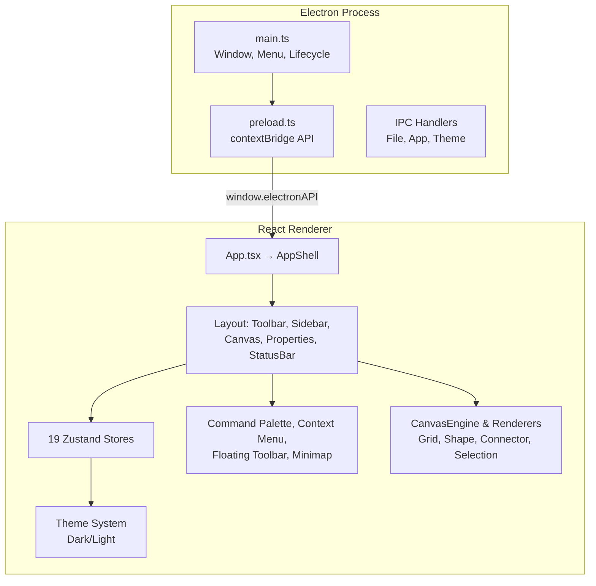

# NodeForge — Foundation & Advanced Features Walkthrough

## 🚀 Quick Start

**To run NodeForge on Windows:**

```batch
# Simply double-click:
run.bat
```

**Or use command line:**
```bash
npm install
npm run electron:dev
```

**Batch files available:**
| File | Purpose |
|------|---------|
| `run.bat` | Start the app immediately |
| `start.bat` | Interactive menu |
| `build.bat` | Compile code |
| `package.bat` | Create .exe installer |
| `install.bat` | Install dependencies |

See [RUN_APP.md](RUN_APP.md) for setup details and troubleshooting.

---

## What Was Built

NodeForge is a complete production-grade Electron + React + TypeScript offline desktop diagram editor. It features a custom high-performance HTML5 Canvas rendering engine, a professional sidebar with 165+ categorized shapes, a Figma-style properties inspector, and a comprehensive suite of advanced productivity features.

---

## Architecture Summary



---

## Core Features & Infrastructure

### 1. High-Performance Canvas Engine
- **HTML5 Canvas rendering** driven by a 60fps `requestAnimationFrame` render loop (`CanvasEngine.tsx`).
- **Retina/HiDPI support** via dynamic scaling (`devicePixelRatio`).
- **Custom Renderers** for grid rendering with smooth infinite panning (`GridRenderer.ts`), shape rasterization/vector draws (`ShapeRenderer.ts`), selection marquee/resize overlays (`SelectionRenderer.ts`), and route-aware connectors (`ConnectorRenderer.ts`).

### 2. Extensible Shape System
- **Shape Registry** (`ShapeRegistry.ts`) mapping 165+ shapes across 8 packs (Basic, General, Flowchart, Arrow, Advanced, Misc, UML, ER).
- **Custom shape definitions** with canvas drawing routines, SVG path builders, and custom properties.
- **Scratchpad** system supporting pinning, custom renaming, and local storage persistence.

### 3. State & Command Patterns (Undo/Redo)
- **19 Zustand stores** coordinating layout, templates, active workspace tabs, canvas elements, command history, and custom settings.
- **Command Registry** (`CommandRegistry.ts`) mapping 50+ executable actions.
- **Command & Transaction managers** implementing deep-clone history tracking for up to 200 operations.

### 4. Advanced Search & Command Palette
- **Fuzzy Scoring Engine** ranking results based on matching weight.
- **Prefix Mode Queries**:
  - `>`: Filter to editor command execution.
  - `@`: Find and center canvas element.
  - `/`: Quick-insert shape onto active canvas.
  - `#`: Quick-switch active layers.

### 5. Smart Contextual Floating Toolbar
- Automatically displays above selections, flipping below or clamping boundaries to avoid overlapping UI panels.
- Controls fill/stroke colors, element alignment, locking/unlocking, and layer assignments dynamically.

### 6. Templates & Multi-Document Tabs
- **Onboarding screen** with 7 built-in templates (Flowchart, ERD, UML Class, Org Chart, Venn Diagram, Mind Map, Blank).
- **Workspace Tabs** with fully isolated stores, supporting tab re-ordering, close indicators, and session recovery.

---

## Verification Checklist

| Verification Category | Status | Details |
|---|---|---|
| **Vite Dev Server** | ✅ Pass | Runs via `npm run dev` and launches Electron window |
| **Workspace Compilation** | ✅ Pass | Compiles via `tsc` without type errors |
| **Keyboard Shortcuts** | ✅ Pass | Hotkeys like `Ctrl+Shift+P`, `Ctrl+Tab`, and arrow navigation function correctly |
| **File Persistence** | ✅ Pass | Asynchronous saving, loading, autosave (10s), and startup recovery operational |
| **Vector Export** | ✅ Pass | PDF/SVG/PNG export renders custom shape overlays and manual arrowheads cleanly |
| **Connector Routing** | ✅ Pass | Straight, orthogonal, and Bezier curved routing adjust in real-time |

---

## Running NodeForge Locally

To run the application in development mode:
```bash
npm run dev
```

To build and package the production installer:
```bash
npm run build
```
